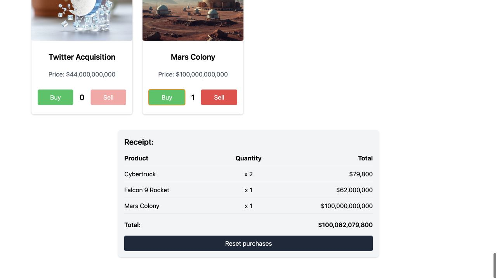

# Spend Elon Musk's Money!

This project was inspired by [Spend Bill Gates' Money](https://neal.fun/spend/). It was created as part of the Patika Front End Bootcamp Week 10 assignment.

## About the Project

Spend Elon Musk's Money is an interactive application that allows users to "purchase" various items using a simulated budget, representing the enormous funds attributed to Elon Musk. The application features a budget tracker, a catalog of items, and a detailed receipt of purchases made during the session.

## Simulation boundaries and asset provenance

- The `$247 billion` starting budget is a fixed simulation value in `src/catalog.js`, not a live net-worth feed.
- Catalog prices are deliberately illustrative and reproducible. They are not current product quotes, financial estimates, or valuations.
- Product artwork was generated for this project with the Flux Schnell image model, then stored locally under `public/images`; the running application makes no image-generation request.
- Product and company names are used as part of the fictional spending exercise and do not imply endorsement or affiliation.

## Live Demo

You can check out the live demo of this project [here](https://spend-elon-musk-money.pages.dev/).

The current deployed application was browser-verified with two Cybertrucks, one Falcon 9, and one Mars Colony. The receipt totaled `$100,062,079,800`; selling one Cybertruck restored exactly `$39,900`, and reset returned the budget to `$247,000,000,000` with an empty receipt.



### Interaction recording


## Features

- Display budget with real-time updates as items are added or removed from the cart.
- An interactive catalog of items with prices, images, and purchase options.
- A receipt section that summarizes all items purchased, with totals displayed.
- Atomic spending rules that prevent overspending and negative quantities, even during rapid input.
- Accessible live budget, quantity, and receipt totals plus a one-click reset.

## Verified behavior

The spending rules are isolated from React rendering and tested for buy/sell accounting, budget limits, non-negative quantities, receipt totals, and reset behavior. A separate catalog-integrity check keeps prices ordered, names unique, and every item connected to its committed local image.

```sh
npm ci
npm test
npm run lint
npm run build
```

## Technologies Used

- React
- Tailwind CSS
